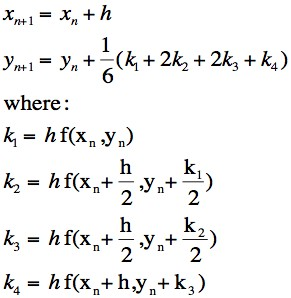

# Hashing algorithm using the chaotic nature of a double pendulum

**NB! This algorithm is a hobby project and not to be used for real security purposes!**

## Summary:
* The string to be hashed is parsed into 4 starting variables for the double pendulum:
    - Angular velocity 1
    - Angular velocity 2
    - Theta 1
    - Theta 2
* When the pendulum's lower arm's Y-position's decimal is below 0.001, both angular velocities and thetas are combined into one variable and recorded (this is marked with a red dot on-screen).
* The previous step repeats until a 256-bit string is produced.

## Benchmarks
This algorithm is quite slow. In fact, REALLY slow. Each hash takes on average 30 miliseconds. Good luck making a rainbow table for this one.

---

A picture of the completed process of hashing the string "password123!".


## Mechanics of the pendulum

RK4 for accurate calculations and floating-point error reduction.



## Useage
```sh
dub run
```