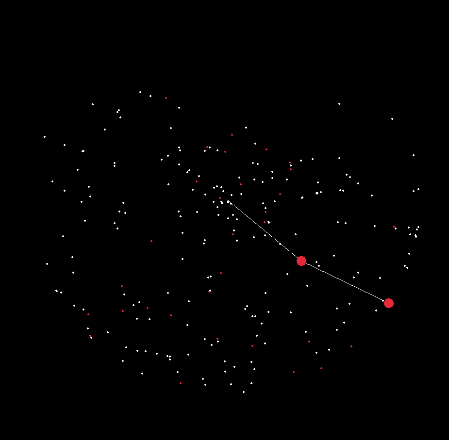

# Hashing algorithm using the chaotic nature of a double pendulum

**NB! This algorithm is a hobby project and not to be used for real security purposes!**

## Summary:
* The string to be hashed is parsed into 4 starting variables for the double pendulum:
    - Angular velocity 1
    - Angular velocity 2
    - Theta 1
    - Theta 2
* When the pendulum's lower arm's Y-position's decimal is below 0.001, both angular velocities and thetas are combined into one variable and recorded (this is marked with a red dot on-screen).
* The previous step repeats until a 256-bit string is produced.

---

A picture of the completed process of hashing the string "password123!".



Example inputs and outputs:
---
a - 98EB6A4CBD30B0E1429A32216FD2B7767CB5BF08622085D4174ABDE6C36020EC
b - 445EB2425E91CBC2EA755D15C608ADF9F3AA4E3BECDFB151C1341030B942D26E
c - A9F4B95F9DEC952DD75646A000C92D6CB231181F611D16BF5E6B2BA695B8831B

password123! - BFCF9EECB076516F17C78B72C576A8EC6746F51CC62F8701D1CE2FD6C9C62FC5
pasword123! - E66FA9F3FBF576C8D46C65D049A5F47F94F3533E9E8797830EB554F6B4A8DF43

The quick brown fox jumps over the lazy dog - 795E20D40FDDBA4032392CF1A4EF6FD7EB6EF29E429F971BCFF54D685EDAB3E8

the quick brown fox jumps over the lazy dog - EA39D3403008DE32876F115794D8517B62692274F780A91163A10A8E44C49E3D


## Mechanics of the pendulum

RK4 for accurate calculations and floating-point error reduction.


## Useage
```sh
dub run
```